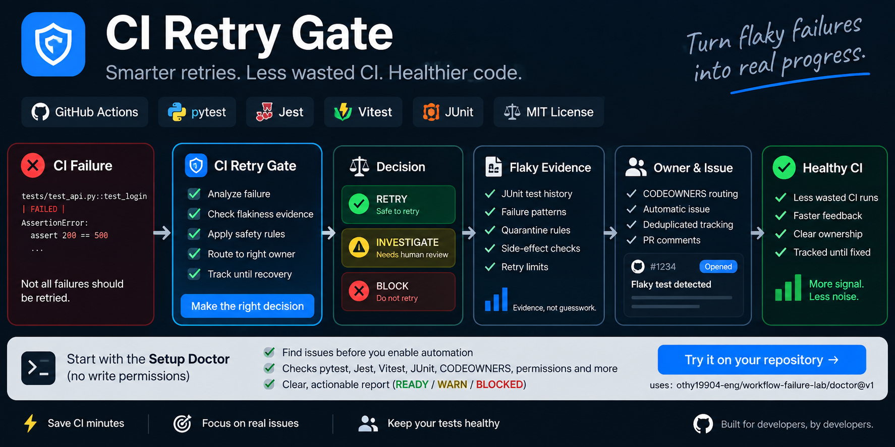
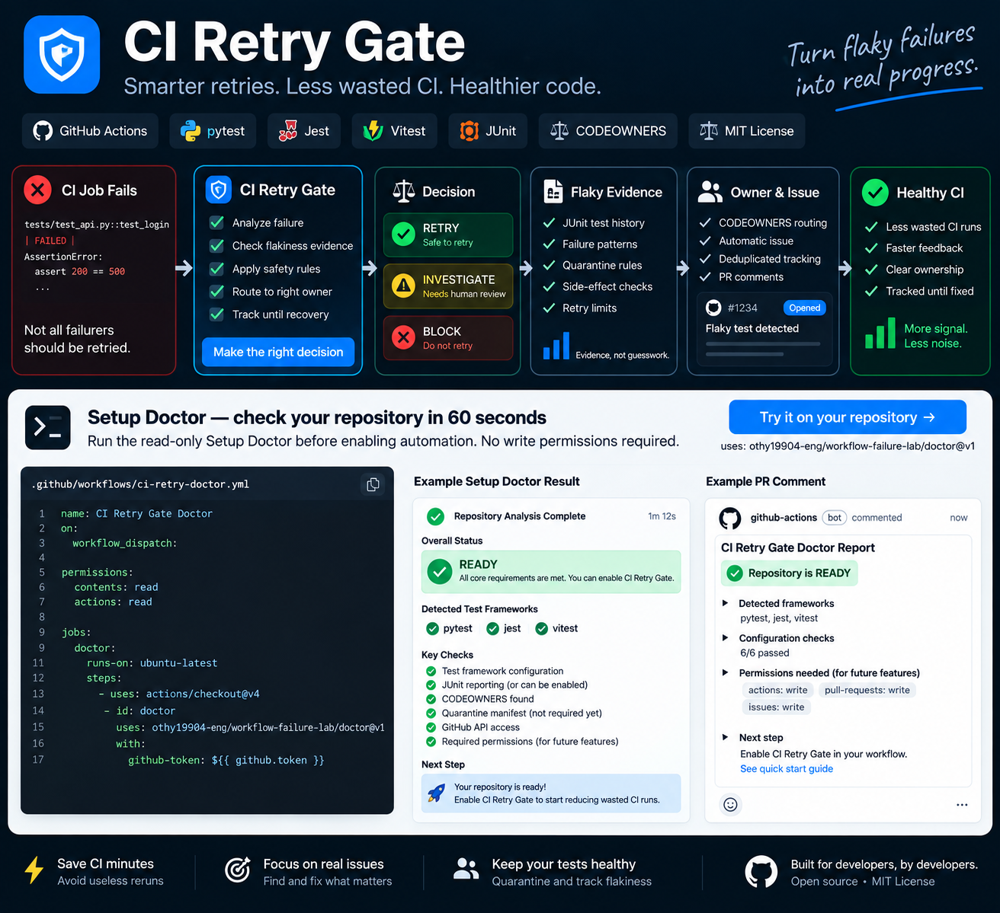

# CI Retry Gate

[](https://github.com/achirothmane/workflow-failure-lab/actions/workflows/ci.yml)
[](https://github.com/achirothmane/workflow-failure-lab/releases/latest)
[](LICENSE)

**[5-minute quickstart](docs/quickstart.md) · [Examples](examples/README.md) · [Product architecture](docs/product-architecture.md) · [Technical reference](docs/technical-reference.md)**



## Know when a failed GitHub Actions job is safe to retry.

CI Retry Gate examines a failed workflow **before** a retry happens.

It returns an evidence-backed `ALLOW` or `BLOCK` decision, explains why, and gives the operator a deterministic next action. Missing, stale, contradictory, or risky evidence fails closed.

**Read-only by default. Write behavior is explicit opt-in.**

### Start here

| If you want to... | Start with |
|---|---|
| See a decision without installing | **[Public-run analyzer](https://github.com/achirothmane/workflow-failure-lab/issues/new?template=public-run-analysis.yml)** |
| Add the gate safely | **[5-minute quickstart](docs/quickstart.md)** |
| Copy a workflow | **[Examples](examples/README.md)** |
| Understand the system shape | **[Product architecture](docs/product-architecture.md)** |

The product surface is intentionally smaller than the repository's research and validation internals. A new user should not need to understand the full engineering history to get a useful result.

### Why use it?

| CI situation | What CI Retry Gate does |
|---|---|
| A job looks transient | Checks whether the evidence actually supports a bounded retry |
| A deterministic regression fails | Keeps CI red instead of hiding it behind a rerun |
| Evidence is missing or contradictory | Returns `BLOCK` / `UNKNOWN` rather than guessing |
| A failed job may have side effects | Blocks retry authority independently of failure classification |
| Several jobs fail | Can distinguish individually eligible jobs from jobs that must stay blocked |

## Try it before installing

**[Analyze one public GitHub Actions failure](https://github.com/achirothmane/workflow-failure-lab/issues/new?template=public-run-analysis.yml)**

Paste:

- a public repository in `owner/repo` form;
- a failed GitHub Actions run ID.

CI Retry Gate analyzes that historical run without changing the target repository.

A result looks like this:

```text
Decision: BLOCK
Evidence: CONTRADICTED
Next action: STOP_RETRY_LOOP
Eligible failed jobs: 0
Blocked failed jobs: 1
```

Interpretation:

| Result | Meaning |
|---|---|
| `ALLOW / SUFFICIENT` | The observed evidence supports the bounded retry policy |
| `BLOCK` | The failure should not receive retry authority |
| `UNKNOWN` | Evidence is insufficient or unavailable, so the gate fails closed |

The first trial has one purpose: **decide whether the evidence improves your retry-versus-investigate decision.** If it does not, do not install anything.

## Install in report-only mode

Start without automatic reruns:

```yaml
name: CI Retry Gate

on:
  workflow_run:
    workflows: ["CI"]
    types: [completed]

permissions:
  actions: read
  checks: read

jobs:
  retry-gate:
    if: ${{ github.event.workflow_run.conclusion == 'failure' }}
    runs-on: ubuntu-latest
    steps:
      - uses: achirothmane/workflow-failure-lab@v1
        with:
          github-token: ${{ github.token }}
          auto-rerun: 'false'
          selective-rerun: 'false'
```

That evaluates the failed run and reports the decision without rerunning anything.

Use `@v1` for the current stable v1 line. Pin an exact `v1.x.y` tag or commit SHA when you need an immutable dependency.

## What the gate checks

A transient-looking error is not enough by itself.

Before retry authority is granted, CI Retry Gate can evaluate:

- failure classification and confidence;
- evidence provenance;
- the exact failed execution step;
- workflow run attempt and head SHA;
- side-effect boundaries;
- retry attempt limits;
- stale or contradictory evidence;
- historical recovery or recurrence evidence where available.

Authorization is bound to the exact workflow state that produced the evidence. If that state changes, the old justification cannot simply be reused.

## Setup Doctor



Before enabling write behavior, run the read-only Setup Doctor:

```yaml
name: CI Retry Gate Doctor

on:
  workflow_dispatch:

permissions:
  contents: read
  actions: read
  checks: read

jobs:
  doctor:
    runs-on: ubuntu-latest
    steps:
      - uses: actions/checkout@v4

      - id: doctor
        uses: achirothmane/workflow-failure-lab/doctor@v1
        with:
          github-token: ${{ github.token }}
          source-workflow: 'CI'
          rerun-mode: 'none'
```

The Doctor returns `READY`, `WARN`, or `BLOCKED` with concrete fixes. When ready, it also generates a copy-ready activation workflow.

It does **not** write that workflow into your repository.

## Safe rollout

1. Analyze one real historical failure.
2. Run Setup Doctor.
3. Install CI Retry Gate in report-only mode.
4. Observe real decisions on your CI.
5. Enable only the write behavior you actually want.

Automatic reruns and selective reruns remain off until explicitly enabled.

## Evidence, not guesswork

CI Retry Gate has been exercised against real GitHub Actions failures, including cases where a later retry recovered and cases where the same failed job recurred.

It also has a separate consumer repository that continuously tests the stable `@v1` interface rather than importing the product source directly:

[ci-retry-gate-consumer-e2e](https://github.com/achirothmane/ci-retry-gate-consumer-e2e)

Release verification includes:

- repository CI;
- compatibility matrix;
- remote `@v1` consumer E2E;
- Public Incident Replay;
- clean-install verification;
- release-readiness checks.

## Beyond a single retry decision

The stable product also includes optional capabilities for teams that need deeper CI reliability work:

- selective safe rerun;
- flaky-test intelligence from JUnit history;
- temporary quarantine lifecycle;
- ownership and triage routing;
- managed flaky-test Issues;
- historical recovery and recurrence evidence;
- policy shadow testing and benchmarking;
- report-only fleet analysis;
- machine-readable evidence and authorization outputs.

These capabilities remain behind the same fail-closed safety model.

For implementation details, inputs, outputs, research gates, classifier behavior, provenance rules, flaky-test lifecycle, and validation methodology, see the **[Technical Reference](docs/technical-reference.md)**.

## Safety defaults

- `auto-rerun: 'false'`
- `selective-rerun: 'false'`
- public analysis is read-only
- missing evidence does not become permission
- contradictory evidence does not become permission
- side-effect risk remains an independent blocker
- historical flakiness does not authorize production retries
- report-only and descriptive outputs cannot grant retry authority

CI Retry Gate cannot prove that arbitrary third-party workflows are safe to rerun. It makes a conservative decision from the evidence available to it and fails closed when that evidence is not strong enough.

## Support

For setup help, bug reports, public-run analysis, and security-reporting guidance, see [SUPPORT.md](SUPPORT.md).

For security vulnerabilities, follow [SECURITY.md](SECURITY.md) rather than opening a public issue.

## License

CI Retry Gate is released under the MIT License. See [LICENSE](LICENSE).
